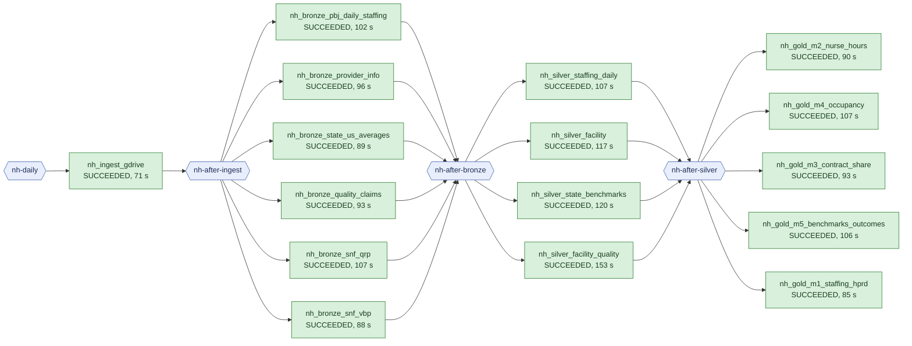

# nh-pipeline run wr_2a7c6f25c977da536f3910608f3ecd8563f0597601df0dbe0c6954ea93df941c

Started 2026-10-21 12:19 UTC; status COMPLETED; run properties: copied_files=21 rejected_files=1.

```mermaid
flowchart LR
  n0{{"nh-after-bronze"}}:::trigger
  n1{{"nh-after-ingest"}}:::trigger
  n2{{"nh-after-silver"}}:::trigger
  n3{{"nh-daily"}}:::trigger
  n4["nh_bronze_pbj_daily_staffing<br/>SUCCEEDED, 102 s"]:::ok
  n5["nh_bronze_provider_info<br/>SUCCEEDED, 96 s"]:::ok
  n6["nh_bronze_quality_claims<br/>SUCCEEDED, 93 s"]:::ok
  n7["nh_bronze_snf_qrp<br/>SUCCEEDED, 107 s"]:::ok
  n8["nh_bronze_snf_vbp<br/>SUCCEEDED, 88 s"]:::ok
  n9["nh_bronze_state_us_averages<br/>SUCCEEDED, 89 s"]:::ok
  n10["nh_gold_m1_staffing_hprd<br/>SUCCEEDED, 85 s"]:::ok
  n11["nh_gold_m2_nurse_hours<br/>SUCCEEDED, 90 s"]:::ok
  n12["nh_gold_m3_contract_share<br/>SUCCEEDED, 93 s"]:::ok
  n13["nh_gold_m4_occupancy<br/>SUCCEEDED, 107 s"]:::ok
  n14["nh_gold_m5_benchmarks_outcomes<br/>SUCCEEDED, 106 s"]:::ok
  n15["nh_ingest_gdrive<br/>SUCCEEDED, 71 s"]:::ok
  n16["nh_silver_facility<br/>SUCCEEDED, 117 s"]:::ok
  n17["nh_silver_facility_quality<br/>SUCCEEDED, 153 s"]:::ok
  n18["nh_silver_staffing_daily<br/>SUCCEEDED, 107 s"]:::ok
  n19["nh_silver_state_benchmarks<br/>SUCCEEDED, 120 s"]:::ok
  n1 --> n4
  n0 --> n18
  n0 --> n19
  n1 --> n5
  n1 --> n6
  n2 --> n11
  n2 --> n13
  n2 --> n12
  n0 --> n16
  n1 --> n9
  n2 --> n14
  n2 --> n10
  n1 --> n7
  n1 --> n8
  n0 --> n17
  n3 --> n15
  n15 --> n1
  n18 --> n2
  n16 --> n2
  n19 --> n2
  n17 --> n2
  n4 --> n0
  n5 --> n0
  n9 --> n0
  n6 --> n0
  n7 --> n0
  n8 --> n0
  classDef ok fill:#d8f0dc,stroke:#2e7d32,color:#1b3d1f
  classDef failed fill:#f9d6d5,stroke:#c62828,color:#5a1414
  classDef stopped fill:#e6e6e6,stroke:#757575,color:#333333
  classDef notrun fill:#ffffff,stroke:#9e9e9e,stroke-dasharray:4 3,color:#555555
  classDef trigger fill:#e8eefc,stroke:#3f5fa8,color:#1c2c55
```
